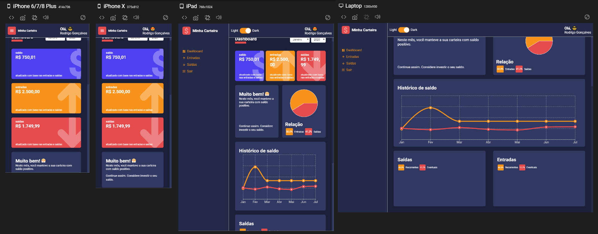

  

# Dashboard de Finanças

Bem-vindo ao **Dashboard de Finanças** desenvolvido em **ReactJs** com **TypeScript**! Este projeto apresenta um design 100% componentizado, utilizando **componentes puros** para garantir uma experiência de usuário eficiente e responsiva.

  

### Armazenamento de Dados

Neste projeto, não utilizamos um banco de dados. Todos os dados são carregados a partir de dois arquivos que simulam repositórios de dados usando arrays.

### Layout & Componentes Responsivos

  

- [x] Visualize o protótipo desenvolvido no [**Figma**](https://www.figma.com/file/UaV4uhlCJyn8cdiKNuOaOp/Minha-Carteira?node-id=0%3A1) para ver o design completo.

### Bibliotecas Utilizadas

- [x] Para os gráficos, utilizamos a biblioteca **[Recharts](http://recharts.org/en-US)**, que é open-source e fácil de integrar.
- [x] Para implementar o efeito de contagem crescente nos números, utilizamos o **[React CountUp](https://www.npmjs.com/package/react-countup)**.

---

  <small>Desenvolvedor: Grazziano Borges Fagundes - 2022</small>

